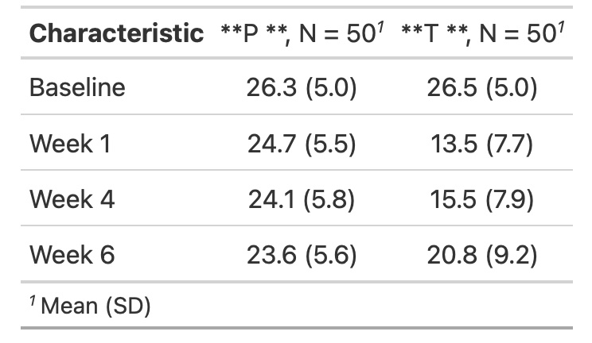

```{r setup, include=FALSE}
options(htmltools.dir.version = FALSE)
```

```{r xaringan-themer, include=FALSE, warning=FALSE}
library(xaringanthemer)
library(emo)
style_mono_accent(base_color = "#49628f",
                 code_font_size = ".5rem",
                 link_color = "white",
                 text_font_family = "Lora",
  text_font_url = "https://fonts.googleapis.com/css?family=Lora:100,700,400italic",
  header_font_google = google_font("Lara"),
                  extra_css = list(
    ".small .remark-code" = list("font-size" = "50%"),
    ".tiny pre code" = list("font-size" = "33%"),
    ".large" = list("font-size" = "250%"),
    ".largeish" = list("font-size" = "200%")
  ))
```

```{r xaringanExtra, echo=FALSE}
xaringanExtra::use_xaringan_extra(c("tile_view", "logo", "tachyons"))
xaringanExtra::use_panelset()
xaringanExtra::use_tachyons()
#xaringanExtra::use_share_again()

```

class: title, middle, inverse

# Longitudinal Data Analysis
### Kansas City R Meetup

.b[Sierra Davis] <br>
March 13, 2021
---
# Outline

.large[

- Introduction
]
--
.large[

- Data Summary
]

--
.large[
- Analysis

]
--
.large[
- Conclusion

]
---

# Longitudinal Data

- individuals are measured repeatedly through time
- study of change over time
- Examples: BMI, treatment data

---

# Dataset


- Throughout this presentation examples will use the Treatment of Lead-Exposed Children Trial dataset.

- These data consist of four repeated measurements of blood lead 
levels obtained at baseline (or week 0), week 1, week 4, and 
week 6 on 100 children who were randomly assigned to treatment or placebo.

- Demonstrate the use of various packages to analyze longitudinal data.

Reference: Treatment of Lead-exposed Children (TLC) Trial Group. (2000).
Safety and Efficacy of Succimer in Toddlers with Blood Lead Levels of 
20-44 µg/dL.  Pediatric Research, 48, 593-599.

```{r include=FALSE}
library(kableExtra)
library(ggplot2)
library(readr)
library(lubridate)
library(dplyr)
library(gtsummary)
library(tidyr)
library(stringr)
library(lme4)
df <- read.csv("tlc-data.csv")

# for example, remove all spaces
df<-df %>% 
  mutate(across(where(is.character), str_remove_all, pattern = fixed(" ")))

df$group<-as.factor(df$group)
```


---

class: inverse, center, middle

.largeish[
Exploratory Data Analysis
]

---

# {glimpse}


```{r}
names(df)
```


```{r}
glimpse(df)
```

---

# {dplyr}


```{r}
df %>% 
  group_by(group) %>% 
  summarize(avg_week_0=mean(week_0),avg_week_1=mean(week_1),
            avg_week_4=mean(week_4),avg_week_6=mean(week_6))
```

---

# {gtsummary} summarize data with tbl_summary()
```
df %>% 
  select(group,week_0,week_1,week_4,week_6) %>% 
tbl_summary(
    by = group,
    label = list(week_0 ~ "Baseline",
                 week_1 ~ "Week 1",
                 week_4 ~ "Week 4",
                 week_6 ~ "Week 6"),
    statistic = list(all_continuous() ~ "{mean} ({sd})"),
    digits = list(week_0 ~ c(1, 1),
                 week_1 ~ c(1, 1),
                 week_4 ~ c(1, 1),
                 week_6 ~ c(1, 1)))
```

```{r, echo=FALSE, out.width="45%"}

```

---

# {tidyr} help you create tidy data

```{r include=FALSE}
theme_Publication <- function(base_size=14, base_family="Helvetica") {
      library(grid)
      library(ggthemes)
      (theme_foundation(base_size=base_size, base_family=base_family)
       + theme(plot.title = element_text(face = "bold",
                                         size = rel(1.2), hjust = 0.5),
               text = element_text(),
               panel.background = element_rect(colour = NA),
               plot.background = element_rect(colour = NA),
               panel.border = element_rect(colour = NA),
               axis.title = element_text(face = "bold",size = rel(1)),
               axis.title.y = element_text(angle=90,vjust =2),
               axis.title.x = element_text(vjust = -0.2),
               axis.text = element_text(),
               axis.line = element_line(colour="black"),
               axis.ticks = element_line(),
               panel.grid.major = element_line(colour="#f0f0f0"),
               panel.grid.minor = element_blank(),
               legend.key = element_rect(colour = NA),
               legend.position = "bottom",
               legend.direction = "horizontal",
               legend.key.size= unit(0.2, "cm"),
               legend.margin = unit(0, "cm"),
               legend.title = element_text(face="italic"),
               plot.margin=unit(c(10,5,5,5),"mm"),
               strip.background=element_rect(colour="#f0f0f0",fill="#f0f0f0"),
               strip.text = element_text(face="bold",size=rel(.62))
          ))
     
}
 
scale_fill_Publication <- function(...){
      library(scales)
      discrete_scale("fill","Publication",manual_pal(values = c("#386cb0","#fdb462","#7fc97f","#ef3b2c","#662506","#a6cee3","#fb9a99","#984ea3","#ffff33")), ...)
 
}
 
scale_colour_Publication <- function(...){
      library(scales)
      discrete_scale("colour","Publication",manual_pal(values = c("#386cb0","#fdb462","#7fc97f","#ef3b2c","#662506","#a6cee3","#fb9a99","#984ea3","#ffff33")), ...)
 
}

```

```{r}
head(df)
```


```{r}
df %>% 
  pivot_longer(week_0:week_6, names_to = "week", values_to = "lead_level")
```

---

# {ggplot2} 

```{r include=FALSE}
avg_df<-df %>% 
  group_by(group) %>% 
  summarize(avg_week_0=mean(week_0),avg_week_1=mean(week_1),
            avg_week_4=mean(week_4),avg_week_6=mean(week_6))
```

```{r fig.height=5, fig.width=7, message=FALSE, warning=FALSE}
avg_df %>% 
  pivot_longer(avg_week_0:avg_week_6, names_to = "week", values_to = "avg_lead_level") %>% 
  ggplot(aes(x=week,y=avg_lead_level,group=group))+
  geom_line(aes(color=group))+
  geom_point(aes(color=group))+
  theme_Publication()
```

---

# {dplyr::sample} 


```{r fig.height=5, fig.width=9, message=FALSE, warning=FALSE}
set.seed(31221)
by_id <- df %>% group_by(ID)
sample_df<-sample_n(df, 6)

sample_df %>%  
  pivot_longer(week_0:week_6, names_to = "week", values_to = "lead_level") %>% 
  ggplot(aes(x=week,y=lead_level,group=group))+
  geom_line(aes(color=group))+
  geom_point(aes(color=group))+
  facet_wrap(~ID) +
  theme_Publication()
```

---

```{r}
long_df <- df %>%  
  pivot_longer(week_0:week_6, names_to = "week", values_to = "lead_level")
```

```{r message=FALSE, warning=FALSE}
ggplot(long_df, aes(lead_level)) + 
  geom_density(aes(data = lead_level, fill = group), position = 'identity', alpha = 0.5) +
  labs(x = 'Lead level', y = 'Density') + scale_fill_discrete(name = 'Group') + scale_x_continuous(limits = c(0, 65)) +
  theme_Publication()
```

---

```{r fig.height=5, fig.width=9, message=FALSE, warning=FALSE}
ggplot(long_df, aes(lead_level)) + 
  geom_density(aes(data = lead_level, fill = group), position = 'identity', alpha = 0.5) +
  labs(x = 'Lead level', y = 'Density') + 
  scale_fill_discrete(name = 'Group') + 
  scale_x_continuous(limits = c(0, 65)) +
  facet_wrap(~week) +
  theme_Publication()
```
---

class: inverse, center, middle

.largeish[
Statistical Analysis
]

---

# {anova}

```{r}
long_df <- df %>%  
  pivot_longer(week_0:week_6, names_to = "week", values_to = "lead_level")
```

```{r}
aov <- anova(lm(lead_level ~ group, data = long_df))
aov
```

- The p-value is far below 0.05, so the null is rejected, and it can be concluded there are differences between the treatment group and the placebo group.
---


class: inverse, center, middle

.largeish[
Modeling
]

---

```{r}
long_df <- df %>%  
  pivot_longer(week_0:week_6, names_to = "week", values_to = "lead_level")
```

```{r}
long_df2 <- df %>%  
  pivot_longer(week_0:week_6, names_to = "week", values_to = "lead_level") %>% 
  mutate(week = case_when(week == "week_0"~0,
                          week == "week_1"~1,
                          week == "week_4"~4,
                          week == "week_6"~6,))
```
---

# {lme4}


```{r}
model1 <- lmer(lead_level ~ week + (1|ID), REML = F,data=long_df2)
AIC(model1)
BIC(model1)
summary(model1)
```

---

```{r}
model2 <- lmer(lead_level ~ week +  (week|ID),REML = F, data=long_df2)
AIC(model2)
BIC(model2)
summary(model2)
```
---

```{r}
model3 <- lmer(lead_level ~ week + group + (week|ID), REML = F,data=long_df2)
AIC(model3)
BIC(model3)
summary(model3)
```

---

```{r}
model4 <- lmer(lead_level ~ 1 + week + group + week:group+ (week|ID), REML = F,data=long_df2)
AIC(model4)
BIC(model4)
summary(model4)
```

---

```{r}
anova(model1, model2,model3,model4)
```

---

 - Next step : tidymodels
---

class: inverse, center, middle

.largeish[
Thank You
]

---
